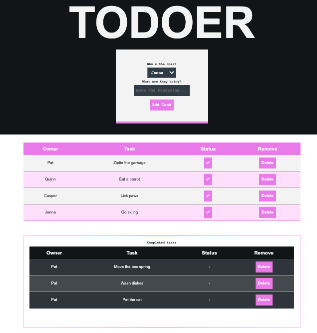

# To-doer

This is an ongoing project I started as a weekend-challenge assignment for Prime Digital Academy.
The current version allows my household to create and assign tasks, then mark them as complete or delete them.

## Browser-based to-do list, full CRUD

Assign and mark off household tasks with this to-do app, developed with front and back-end functionality. PUT and DELETE routes allow users to update the database on the status of a given task. Vanilla javascript on the client-side sends finished tasks to a separate table.

## See it

## Checklist
### build

[X] setup files
[X] setup server
[X] bring in pg and pool to talk with db
[X] make db
[X] build out HTML interface
[X] jQuery/ajax for talking DOM and server
[X] make routes (GET, POST, PUT & DELETE)
[X] use CSS to style page and table
### functionality

[X] inputs and button should work to assign new tasks
[X] each task should be "markable," when complete
[X] find way to change appearance/move when marked complete
[X] each task should have delete button to erase 